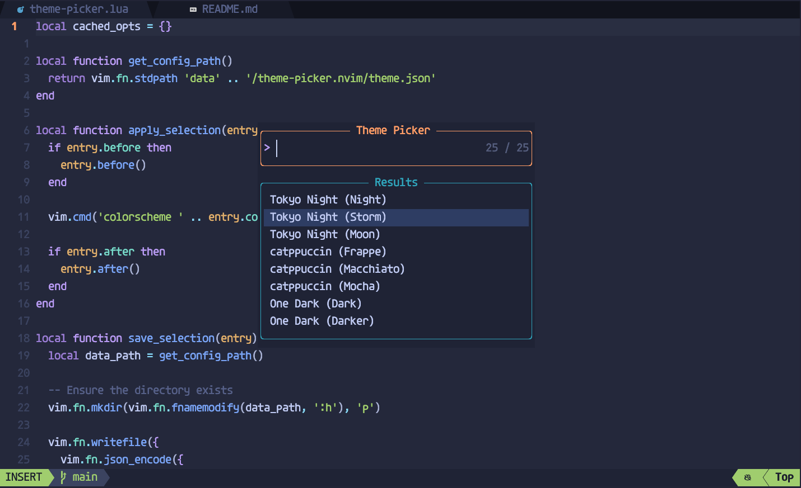

# theme-picker.nvim

`theme-picker.nvim` is a theme selection plugin for Neovim that allows users to easily choose and apply different color schemes.



## Installation

Install using [lazy.nvim](https://github.com/folke/lazy.nvim)

```lua
return {
  {
    'panghu-huang/theme-picker.nvim',
    lazy = false,
    opts = {
      -- Options passed to Telescope
      picker = {
        layout_config = {
          width = 0.35,
          height = 0.5,
        },
        -- ...
      },
      themes = {
        {
          name = 'Tokyo Night (Night)',
          colorscheme = 'tokyonight-night',
        },
        {
          name = 'Tokyo Night (Storm)',
          colorscheme = 'tokyonight-storm',
        },
        {
          name = 'One Dark (Dark)',
          colorscheme = 'onedark',
          before = function()
            vim.g.onedark_config = {
              style = 'dark'
            }
          end,
        },
        {
          name = 'One Dark (Darker)',
          colorscheme = 'onedark',
          before = function()
            vim.g.onedark_config = {
              style = 'darker'
            }
          end,
        },
    -- Add more themes
      }
    },
  },
}
```

### Configuration Options

- `themes`: A table containing themes, each with `name` and `colorscheme` fields.
- `picker`: Options passed to Telescope.

## Usage

Open the theme picker:

```lua
require('theme-picker').open_theme_picker()
```

## Functions

### `setup(opts)`

Initialize the plugin and restore the last selected theme.

- `opts`: Configuration options.

### `open_theme_picker(opts)`

Open the theme picker.

- `opts`: Optional configuration options that override the setup configuration.

## Example

```lua
require('theme-picker').setup({
  themes = {
    { name = 'gruvbox', colorscheme = 'gruvbox' },
    { name = 'onedark', colorscheme = 'onedark' },
    { name = 'nord', colorscheme = 'nord' },
  },
  picker = {
    prompt_title = 'Select Theme',
  }
})

vim.api.nvim_set_keymap('n', '<leader>tp', ':lua require("theme-picker").open_theme_picker()<CR>', { noremap = true, silent = true })
```

## Dependencies

- [Telescope.nvim](https://github.com/nvim-telescope/telescope.nvim)

## License

MIT License.

